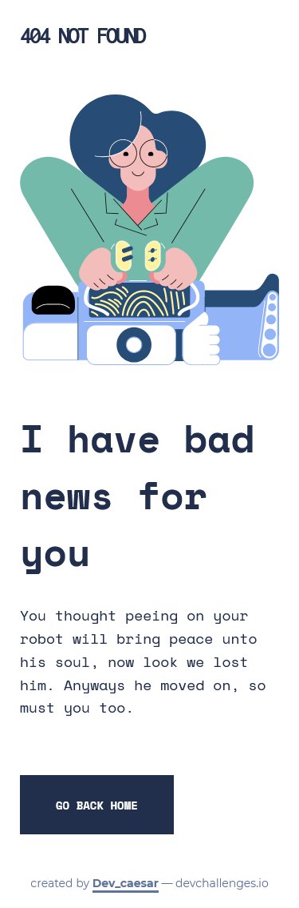

# devchallenges - 404 page challenge

This is a solution to the [404 error page challenge on devchallenges.io](https://devchallenges.io/challenges/wBunSb7FPrIepJZAg0sY).

### The challenge

Users should be able to:

- View the optimal layout depending on their device's screen size

### Screenshot

### Links

- Solution URL: [Add solution URL here](https://your-solution-url.com)
- Live Site URL: [Add live site URL here](https://your-live-site-url.com)

### Built with

- Semantic HTML5 markup
- CSS custom properties
- CSS Grid
- Mobile-first workflow

## Author

- Dev Challenger - [@dev_caesar](https://devchallenges.io/portfolio/Dev-Caesar)

